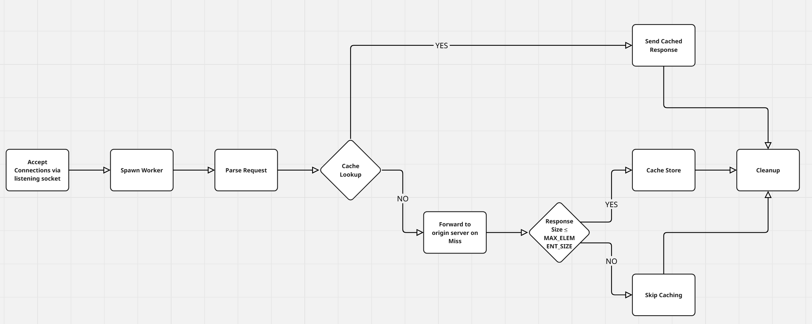

# MultiThreaded Proxy Server with and without cache

A simple multithreaded HTTP proxy server written in **C**. This project intercepts client HTTP requests, forwards them to target servers, and optionally caches responses in memory using an LRU (Least Recently Used) eviction policy. It leverages **POSIX threads**, **Linux sockets**, and a HTTP parsing module.

---

## Motivation & Need of Project

To Understand →

- The working of HTTP requests from the local computer to the server
- Handling of multiple client requests from various clients
- Locking procedures for concurrency control
- The concept of cache and its different functions as used by browsers

Proxy Server does →

- Speeds up processing and reduces traffic on the origin server
- Can restrict user access to specific websites
- Hides client identity by changing the IP address presented to the server
- Can be enhanced to encrypt requests, preventing illegal interception from the client side

---

## Features

- **Intercepts & Forwards** HTTP/1.0 and HTTP/1.1 requests between clients and origin servers
- **Thread-per-Connection** model using **POSIX threads (pthread)** for handling multiple simultaneous clients
- **Synchronized In-Memory LRU Cache** implemented with a linked list and **pthread mutexes** for thread-safe caching
- **HTTP Parser** (`proxy_parse` module) for request line and header extraction
- **Graceful Error Handling** with `perror()` and custom HTTP error responses (400, 403, 404, 500, 501, 505)
- Configurable **cache size** and **max element size** to protect against memory overuse
- **Makefile** automation for building and cleaning on Linux systems

---

## Tech Stack, Libraries & CS Fundamentals used

- **C** (C11)
- **POSIX Threads** (`pthread`)
- **Linux Sockets API** (`socket`, `bind`, `listen`, `accept`, `setsockopt`)
- **HTTP Parsing** via `proxy_parse` module (external source)
- **LRU Cache** using linked list and `time()` for eviction tracking\*\* using linked list and `time()` for eviction tracking
- **Build Tools**: `gcc`, `make`
- Semaphore and mutexes

---

## Getting Started

### Prerequisites

- A Linux environment (Ubuntu, Debian, Fedora, etc.) or **Windows Subsystem for Linux (WSL)**
- GCC or compatible C compiler

### Clone & Build

```bash
git clone https://github.com/LordPranjay/Multithreaded-Web-Server.git
cd Multithreaded-Web-Server
make all
```

This produces the executable `proxy` in the project root.

### Configuration

- **Port**: Proxy listens on a port you specify at runtime.
- **Cache Limits** (optional): You can adjust `MAX_SIZE` and `MAX_ELEMENT_SIZE` in `cache.h` before building.

### Run the Proxy

```bash
./proxy <listen_port>
```

Example:

```bash
./proxy 8080
```

Configure your browser or client to use `localhost:8080` as the HTTP proxy.

---

## Execution Flow Diagram

1. **Accept Connections**: The main thread sets up a listening socket and loops on `accept()`.
2. **Spawn Worker**: For each new client, a detached `pthread` is created to handle the session.
3. **Parse Request**: The worker reads the request buffer and uses the `proxy_parse` module to fill a `ParsedRequest` struct.
4. **Cache Lookup**: If caching is enabled, the URL is looked up in the LRU cache under a mutex lock. On a hit, the cached response is sent immediately.
5. **Forward on Miss**: On a miss, the proxy opens a connection to the origin server, forwards the request, reads the response, and writes it back to the client.
6. **Cache Store**: If response size ≤ `MAX_ELEMENT_SIZE`, the data and URL are copied into a new `cache_element`, inserted at the head of the LRU list, and old entries are evicted to maintain total `MAX_SIZE`.
7. **Cleanup**: The client socket is closed and the worker thread exits.


---

## Troubleshooting & Tips

- **Address already in use**: Ensure no other process is bound to your port, or enable `SO_REUSEADDR` in the code
- **Cache thrashing**: Adjust `MAX_SIZE` and `MAX_ELEMENT_SIZE` to fit your response sizes
- This code can be run only in a Linux environment
- Disable your browser cache before running the code


